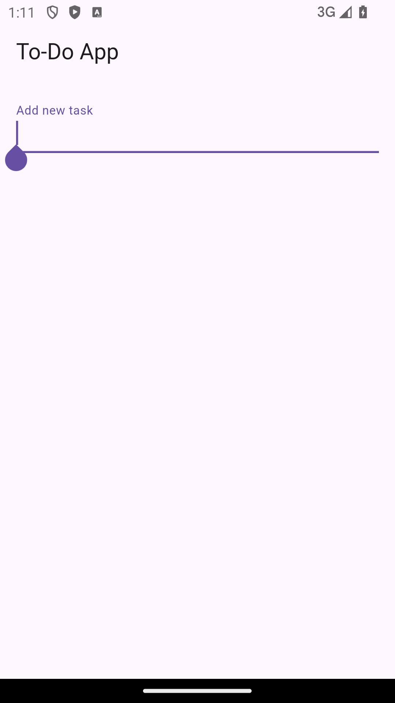
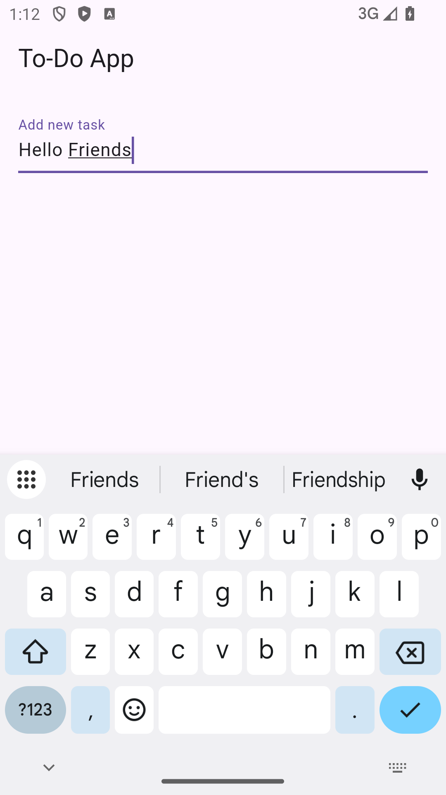
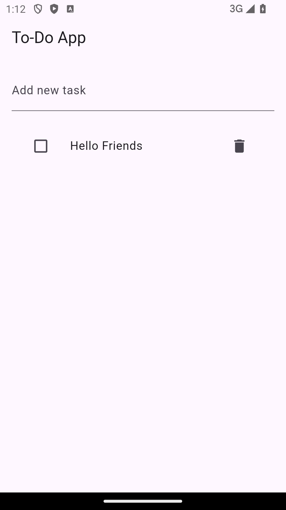
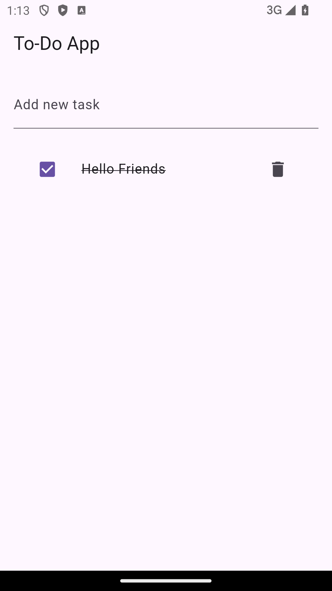

# 📘 Project: To-Do App v2 (Using Provider)

##g
   - Use Provider + ChangeNotifier for state
   - No local DB

## 🏗️ Step-by-Step Plan

### 📦 Step 1: Project Setup

    flutter create todo_provider_app
    cd todo_provider_app
    code .

### 🧩 Step 2: Add provider dependency

#### pubspec.yaml me add karo:
dependencies:
  flutter:
    sdk: flutter
  provider: ^6.1.1

## 📁 Folder Structure (Simple for Now)

    lib/
    │
    ├── main.dart
    ├── models/
    │   └── todo.dart
    ├── providers/
    │   └── todo_provider.dart
    ├── screens/
    │   └── home_screen.dart

### 📄 Step 3: Model - Todo
    lib/models/todo.dart
     
    class Todo {
      String title;
      bool isDone;
    
      Todo({
        required this.title, 
        this.isDone = false,
      });
    }

### 🔄 Step 4: Provider - TodoProvider
    lib/providers/todo_provider.dart
     
    import 'package:flutter/material.dart';
    import '../models/todo.dart';
    
    class TodoProvider with ChangeNotifier {
      List<Todo> _todos = [];
    
      List<Todo> get todos => _todos;
    
      void addTodo(String title) {
        _todos.add(Todo(title: title));
        notifyListeners();
      }
    
      void toggleTodo(int index) {
        _todos[index].isDone = !_todos[index].isDone;
        notifyListeners();
      }
    
      void removeTodo(int index) {
        _todos.removeAt(index);
        notifyListeners();
      }
    }

### 🧠 Step 5: Home Screen UI
    lib/screens/home_screen.dart

    import 'package:flutter/material.dart';
    import 'package:provider/provider.dart';
    import '../providers/todo_provider.dart';
    
    class HomeScreen extends StatelessWidget {
      HomeScreen({super.key});
    
      final TextEditingController _controller = TextEditingController();
    
      @override
      Widget build(BuildContext context) {
    final todoProvider = Provider.of<TodoProvider>(context);
    
        return Scaffold(
          appBar: AppBar(title: const Text('To-Do App')),
          body: Padding(
            padding: const EdgeInsets.all(16),
            child: Column(
              children: [
                TextField(
                  controller: _controller,
                  decoration: const InputDecoration(labelText: 'Add new task'),
                  onSubmitted: (value) {
                    if (value.isNotEmpty) {
                      todoProvider.addTodo(value);
                      _controller.clear();
                    }
                  },
                ),
                const SizedBox(height: 20),
                Expanded(
                  child: ListView.builder(
                    itemCount: todoProvider.todos.length,
                    itemBuilder: (context, index) {
                      final todo = todoProvider.todos[index];
                      return ListTile(
                        leading: Checkbox(
                          value: todo.isDone,
                          onChanged: (_) => todoProvider.toggleTodo(index),
                        ),
                        title: Text(
                          todo.title,
                          style: TextStyle(
                            decoration: todo.isDone
                                ? TextDecoration.lineThrough
                                : TextDecoration.none,
                          ),
                        ),
                        trailing: IconButton(
                          icon: const Icon(Icons.delete),
                          onPressed: () => todoProvider.removeTodo(index),
                        ),
                      );
                    },
                  ),
                )
              ],
            ),
          ),
        );
      }
    }

### 🧠 Step 6: Hook into Provider in main.dart

    import 'package:flutter/material.dart';
    import 'package:provider/provider.dart';
    import 'providers/todo_provider.dart';
    import 'screens/home_screen.dart';
    
    void main() {
      runApp(
        ChangeNotifierProvider(
          create: (_) => TodoProvider(),
          child: const MyApp(),
        ),
      );
    }
    
    class MyApp extends StatelessWidget {
      const MyApp({super.key});
    
      @override
      Widget build(BuildContext context) {
        return MaterialApp(
          title: 'To-Do App',
          home: HomeScreen(),
          debugShowCheckedModeBanner: false,
        );
      }
    }

## ✅ Final Result

- Add new task
- Mark done / undo
- Remove task
- All managed by Provider 🔥

## 📱 Screenshots

### Home Screen

### Step by Step Process Screenshots
### 1.

### 2.

### 3.
